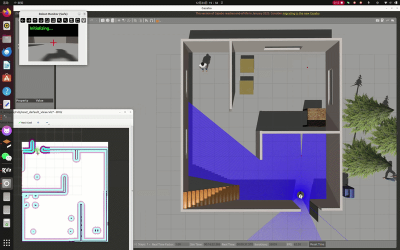

# 🤖 ROS2-IntelliBot 


An advanced, open-source autonomous mobile manipulator built on ROS 2. This project integrates 2D LiDAR SLAM, Nav2 autonomous navigation, vision-guided robotic manipulation, and multi-modal human-robot interaction (Voice & Gesture control) into a unified simulation and control framework.

<div align="center">
  
  <br/>
  <sup><em><strong>Main Demo:</strong> Fully autonomous mission featuring navigation to a target and precision grasping utilizing Image-Based Visual Servoing (IBVS).</em></sup>
</div>

## 📖 Table of Contents
*[🌟 Key Features](#-key-features)
* [🛠️ System Architecture](#️-system-architecture)
* [🚀 Getting Started](#-getting-started)
  * [Prerequisites](#prerequisites)
  *[Installation & Workspace Setup](#installation--workspace-setup)
  * [Build](#build)
*[🕹️ Usage & Demo](#️-usage--demo)
  * [1. Simulation & Manual Control](#1-simulation--manual-control)
  * [2. SLAM & Map Building](#2-slam--map-building)
  * [3. Autonomous Navigation](#3-autonomous-navigation)
  *[4. Advanced Human-Robot Interaction](#4-advanced-human-robot-interaction)
* [💡 Technical Implementation Details](#-technical-implementation-details)
* [⚠️ Troubleshooting & Lessons Learned](#️-troubleshooting--lessons-learned)

## 🌟 Key Features

- 🗺️ **Robust SLAM & Odometry:** High-precision 2D mapping using `slam_toolbox`, supported by an Extended Kalman Filter (EKF) that fuses IMU and wheel odometry to eliminate sensor drift.
- 🧭 **Autonomous Navigation:** Reliable point-to-point dynamic obstacle avoidance and waypoint navigation powered by the `Nav2` stack.
- 🦾 **Visual Servoing & Grasping:** Dual-loop PID-controlled Image-Based Visual Servoing (IBVS) utilizing HSV color segmentation for pixel-perfect object alignment and grasping.
- 🗣️ **Offline Voice Control:** Deploys the lightweight Vosk API offline speech recognition model for low-latency, real-time command execution.
- ✋ **Gesture Recognition:** Touchless teleoperation and task triggering via MediaPipe, mapping 21 hand keypoints to robot kinematics.

## 🛠️ System Architecture

The core logic operates on a highly concurrent **Multi-threaded Architecture**. To prevent blocking I/O operations (e.g., Nav2 action feedback, Vosk audio listening) from freezing the high-frequency control loop, tasks are decoupled into daemon threads. A **Finite State Machine (FSM)** arbitrates command authority with a strict safety hierarchy: **Safety E-Stop (Fist Gesture) > Manual Teleop > Autonomous Mission (Nav/Grasp)**.

## 🚀 Getting Started

### Prerequisites
*   Ubuntu 22.04
*   ROS 2 Humble Hawksbill
*   Python 3.10+

### Installation & Workspace Setup

1.  **Clone the repository:**
    ```bash
    mkdir -p ~/ros2_ws/src
    cd ~/ros2_ws/src
    git clone https://github.com/amysong-robotics/ros2-mobile-manipulator.git
    ```

2.  **Install System Dependencies:**
    ```bash
    cd ~/ros2_ws
    sudo apt update
    sudo apt install -y ros-humble-navigation2 ros-humble-nav2-bringup ros-humble-slam-toolbox ros-humble-cv-bridge ros-humble-vision-opencv ros-humble-image-transport ros-humble-robot-localization
    ```

3.  **Install Python Dependencies:**
    ```bash
    pip3 install opencv-python numpy mediapipe vosk
    ```

4.  **Configure Offline Voice Model:**
    *   Download the `vosk-model-small-cn-0.22` model from the[Vosk Official Site](https://alphacephei.com/vosk/models).
    *   Extract and place the `model` folder into `~/ros2_ws/src/syz_voice_control/syz_voice_control/`.

### Build
Compile the workspace and source the overlay:
```bash
cd ~/ros2_ws
colcon build --symlink-install
source install/setup.bash
    ```

## 🕹️ Usage & Demo

*(Note: Always source your workspace `source ~/ros2_ws/install/setup.bash` before running commands.)*

### 1. Simulation & Manual Control
Launch the Gazebo physics environment and control the robot via keyboard teleoperation.
    ```bash
    # Terminal 1: Launch Gazebo world
ros2 launch syz_car_gazebo gazebo.launch.py

    # Terminal 2: Run keyboard teleop
ros2 run teleop_twist_keyboard teleop_twist_keyboard
    ```

### 2. SLAM & Map Building
Drive the robot around to map the unknown environment using LiDAR data.
    ```bash
    ros2 launch syz_car_description slam.launch.py
    ```
*(Don't forget to save your map using the Nav2 map saver CLI once finished!)*

### 3. Autonomous Navigation
Launch the Nav2 stack with your pre-built map and send `Nav2 Goal` poses via RViz2.
    ```bash
    ros2 launch syz_car_navigation navigation.launch.py
    ```

### 4. Advanced Human-Robot Interaction (Full System Demo)
Integrate all subsystems to perform complex voice or gesture-activated retrieval tasks.
    ```bash
    # Terminal 1: Launch Gazebo world
    ros2 launch syz_car_gazebo gazebo.launch.py

    # Terminal 2: Launch the Navigation stack
    ros2 launch syz_car_navigation navigation.launch.py

    # Terminal 3: Run the Grasping & Interaction node
    ros2 run syz_car_grasping fetch_coke
    ```
*   **Voice Command:** Say designated keywords to trigger autonomous grasping.
*   **Gesture Control:** Use camera-facing hand gestures to teleoperate the chassis or control the robotic arm.

## 💡 Technical Implementation Details
<details>
<summary><strong>Click to expand for deep dive</strong></summary>

*   **Digital Twin Modeling:** The robot's 4-DOF manipulator and differential drive base were modeled in SolidWorks, exported to URDF, and optimized using XACRO macros. Gazebo plugins were integrated for sensor simulation (LiDAR, RGB camera, IMU) and ROS 2 control interfaces.
*   **Image-Based Visual Servoing (IBVS):** The vision pipeline processes RGB feeds via OpenCV (HSV masking & morphological filtering). A dual-loop PID controller converts bounding-box centroid pixel errors into `/cmd_vel` angular and linear velocities, achieving sub-centimeter alignment prior to grasping.
*   **Thread Safety:** Shared resources (like the latest OpenCV image frame and system status flags) are protected using Python's `threading.Lock()` to ensure data consistency across the asynchronous ROS 2 callbacks and the main visualization thread.

</details>

## ⚠️ Troubleshooting & Lessons Learned
<details>
<summary><strong>Click to expand for common issues and engineering solutions</strong></summary>

*   **Issue:** Significant odometry drift during chassis rotation in Gazebo, severely degrading SLAM and Nav2 accuracy.
*   **Root Cause:** The omnidirectional caster wheel was modeled as a `fixed` joint in the URDF due to friction simulation limits, causing physical slippage discrepancies in the Gazebo engine.
*   **Engineering Solution:** Deployed the `ekf_node` from `robot_localization` to perform weighted sensor fusion of the raw wheel odometry and the IMU data. This generated a robust `/odom/filtered` topic, eliminating rotational drift.
*   **Implementation Catch:** To prevent TF tree conflicts, the default odometry publisher in the Gazebo differential drive plugin had to be explicitly disabled (`<publish_odom>false</publish_odom>`) inside the XACRO file, ensuring Nav2 only subscribes to the EKF-fused odometry.

</details>
