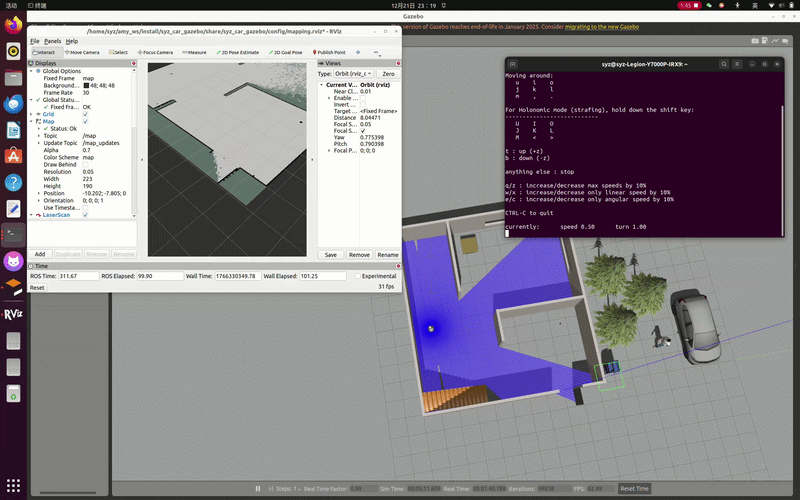
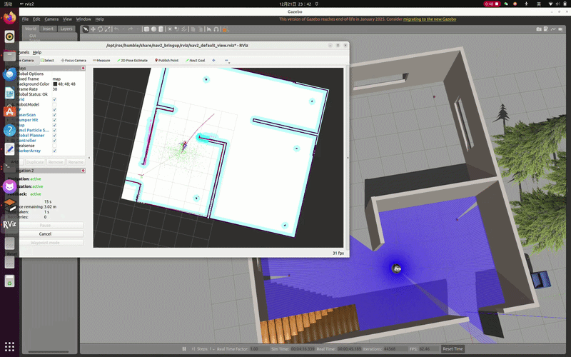

# 🤖 ROS2-IntelliBot 


An advanced, open-source autonomous mobile manipulator built on ROS 2. This project integrates mapping, navigation, robotic arm manipulation, and multi-modal human-robot interaction (Voice & Gesture control) into a single mobile platform.

<div align="center">
  
  <br/>
  <sup><em><strong>Main Demo:</strong> Fully autonomous mission featuring navigation to a target and precision grasping using visual servoing.</em></sup>
</div>

## 📖 Table of Contents
* [🌟 Key Features](#-key-features)
* [🛠️ System Architecture](#️-system-architecture)
* [🚀 Getting Started](#-getting-started)
  * [Prerequisites](#prerequisites)
  * [Installation & Workspace Setup](#installation--workspace-setup)
  * [Build](#build)
* [🕹️ Usage & Demo](#️-usage--demo)
  * [1. Simulation & Manual Control](#1-simulation--manual-control)
  * [2. SLAM & Map Building](#2-slam--map-building)
  * [3. Autonomous Navigation](#3-autonomous-navigation)
  * [4. Advanced Human-Robot Interaction](#4-advanced-human-robot-interaction)
* [💡 Technical Implementation Details](#-technical-implementation-details)
* [⚠️ Troubleshooting](#️-troubleshooting)

## 🌟 Key Features

- 🗺️ **SLAM & Mapping:** High-precision 2D map generation using SLAM Toolbox, with EKF fusion for enhanced localization accuracy.
- 🧭 **Autonomous Navigation:** Reliable point-to-point and multi-point navigation powered by the Nav2 framework.
- 🦾 **Visual Servoing & Grasping:** PID-controlled visual servoing based on HSV color segmentation for precise object alignment and grasping.
- 🗣️ **Offline Voice Control:** Uses the Vosk offline model for robust, real-time command recognition.
- ✋ **Gesture Recognition:** Touchless control via MediaPipe, mapping hand gestures to high-level commands and low-level teleoperation.

## 🛠️ System Architecture

The entire system is designed with a multi-threaded architecture to handle blocking tasks (like Nav2 actions and voice listening) without freezing the main UI/control loop. A Finite State Machine (FSM) arbitrates control commands with a clear priority hierarchy: **Safety (E-stop gesture) > Manual Control (Gesture teleop) > Automated Tasks (Navigation/Grasping)**.

## 🚀 Getting Started

### Prerequisites
*   Ubuntu 22.04
*   ROS 2 Humble Hawksbill
*   Git

### Installation & Workspace Setup

1.  **Clone the repository:**
    ```bash
    # Create a new ROS 2 workspace
    mkdir -p ~/ros2_ws/src
    cd ~/ros2_ws/src

    # Clone this project
    git clone https://github.com/amysong-robotics/ros2-mobile-manipulator.git
    ```

2.  **Install System Dependencies (ROS 2 packages):**
    ```bash
    cd ~/ros2_ws
    sudo apt update
    sudo apt install -y ros-humble-navigation2 ros-humble-nav2-bringup ros-humble-slam-toolbox ros-humble-cv-bridge ros-humble-vision-opencv ros-humble-image-transport
    ```

3.  **Install Python Dependencies (Vision & Voice):**
    ```bash
    pip3 install opencv-python numpy mediapipe vosk
    ```

4.  **Download Offline Voice Model:**
    *   Download the model `vosk-model-small-cn-0.22` from [Vosk Models Page](https://alphacephei.com/vosk/models).
    *   Unzip and place the `model` folder into `~/ros2_ws/src/syz_voice_control/syz_voice_control/`.

### Build
Once all dependencies are installed, build the workspace:
```bash
cd ~/ros2_ws
colcon build
```

## 🕹️ Usage & Demo
Always source your workspace before running any commands.
```bash
source ~/ros2_ws/install/setup.bash
```

### 1. Simulation & Manual Control
Launch the Gazebo world and spawn the robot. You can manually control it using the keyboard for basic testing.
```bash
# Launch Gazebo world
ros2 launch syz_car_gazebo gazebo.launch.py

# In a new terminal, run keyboard teleop
ros2 run teleop_twist_keyboard teleop_twist_keyboard
```

### 2. SLAM & Map Building
Use keyboard teleop to drive the robot around and build a map of the environment.
```bash
ros2 launch syz_car_description slam.launch.py
```
After mapping, save your map.
<div align="center">
  
  <br/>
  <sup><em>Live SLAM process in Gazebo and RViz.</em></sup>
</div>

### 3. Autonomous Navigation
Launch the full navigation stack with a pre-built map and set a goal in RViz.
```bash
ros2 launch syz_car_navigation navigation.launch.py
```
<div align="center">
  
  <br/>
  <sup><em>Nav2 successfully guiding the robot to the goal.</em></sup>
</div>

### 4. Advanced Human-Robot Interaction
This is the ultimate demo, integrating all functionalities. Launch the core systems first, then the interaction node.
```bash
# Terminal 1: Launch Gazebo world
ros2 launch syz_car_gazebo gazebo.launch.py

# Terminal 2: Launch the Navigation stack
ros2 launch syz_car_navigation navigation.launch.py

# Terminal 3: Launch the Grasping & Interaction node
ros2 launch syz_car_grasping fetch_coke.py
```
Now you can use voice commands or hand gestures to initiate complex tasks.

**Voice-Activated Grasping:**
<div align="center">
  
  <br/>
  <sup><em>Triggering a grasp action using a voice command.</em></sup>
</div>

**Gesture-Based Control:**
<div align="center">
  
  <br/>
  <sup><em>Initiating a task and manually controlling the robot via hand gestures.</em></sup>
</div>

## 💡 Technical Implementation Details
<details>
<summary><strong>Click to expand for more technical insights</strong></summary>

*   **Modeling:** The robot's URDF was created in SolidWorks and exported using the `sw_urdf_exporter`. XACRO was used to simplify the model and add Gazebo plugins for simulation physics and ROS 2 control interfaces.
*   **Visual Servoing:** The grasping pipeline uses OpenCV for HSV color-based object detection. A PID controller takes the pixel error (between the object's centroid and the camera's center) as input to generate `/cmd_vel` commands, precisely aligning the robot before grasping.
*   **Multi-Threaded Architecture:** To prevent blocking IO operations (like `Vosk` listening and `Nav2` action feedback) from freezing the main control loop, the system heavily relies on Python's `threading`. Navigation tasks and voice listening run in separate daemon threads, while the main thread handles the high-frequency MediaPipe and OpenCV processing. A `threading.Lock()` mechanism is used to ensure thread-safe access to shared resources like the latest camera frame.
*   **Command Arbitration:** A Finite State Machine (FSM) was designed to manage control authority from multiple sources. This prevents command conflicts and ensures safe operation, with a "fist" gesture acting as a high-priority emergency stop.

</details>

## ⚠️ Troubleshooting
<details>
<summary><strong>Click to expand for common issues and solutions</strong></summary>

*   **Problem:** The robot drifts significantly during turns in Gazebo, affecting navigation accuracy.
*   **Cause:** The omnidirectional caster wheel was simplified as a `fixed` joint in the URDF, causing physical discrepancies in simulation.
*   **Solution:** An **Extended Kalman Filter (EKF)** from the `robot_localization` package was implemented to fuse IMU and wheel odometry data. This provides a much more accurate state estimation (`/odom`) and significantly improves navigation performance.

*   **Problem:** The EKF's odometry topic (`/odom/filtered`) conflicts with the Gazebo differential drive plugin's original odometry topic, causing data jumps.
*   **Solution:** In the Gazebo plugin configuration within the XACRO file, the original odometry publisher was disabled (`<publish_odom>false</publish_odom>`) to ensure only the EKF's fused odometry is used by the Nav2 stack.

</details>
